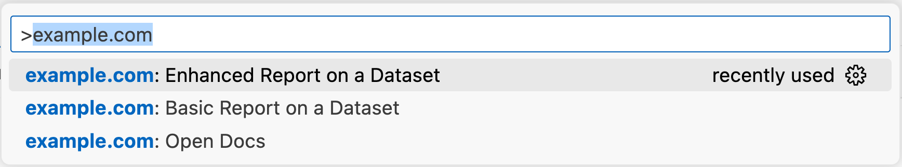
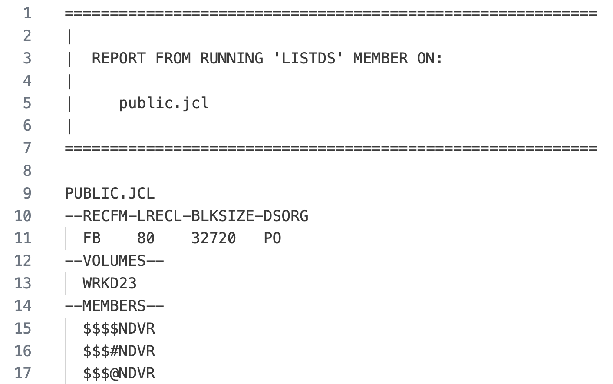

# VS Code Extension for the Example.com Company

This is an example of an extension the company `example.com` might want to create to supplement Code4z with custom, company-specific functionality.

## Make Your Custom ISPF Apps Available in VS Code

If you have custom ISPF panels for your internal processes, you can make their functionality available in VS Code as part of your DevOps modernization.

The following sections outline the steps to take.

### Update Your ISPF Application to Run in Plain TSO

1. Update your ISPF application to accept arguments instead of relying on screen inputs.
1. Update the application to store its output to a dataset, or print it to the terminal instead of showing the result on an ISPF screen.
1. Test your updated application by running it in TSO without ISPF and check its output.
1. Run your updated application through Zowe CLI. Issue the following command: `zowe tso issue command "exec 'PUBLIC.REXX(REPOUT)' 'ARG1 ARG2'"`, where `PUBLIC.REXX(REPOUT)` is your REXX application and `ARG1` `ARG2` are the arguments that are passed to it. The syntax above works both in Windows CMD and PowerShell as well as in Bourne compatible UNIX shells.

### Use the Basic-Report Command in This Extension

1. Update the `REXX_EXEC` constant in [basic-report.js](commands/basic-report.js#L6) to point to your application.
1. Start the extension by pressing <kbd>F5</kbd>. This opens a new VS Code window with this extension.
1. In this new VS Code window open the Command Palette by pressing <kbd>F1</kbd>
1. Type `example.com` in the command palette input box.  
   A list of commands displays.
   
1. Select the `Basic Report on a Dataset` command.
1. After a short moment an editor with the output of your applications opens.

To try this out with a basic REXX program, you can use the included [basic-report.rexx](commands/basic-report.rexx) sample. A successful output report looks like this:



### Explore the Enhanced-Report

The [basic report](commands/basic-report.js) is only 30 lines long. It is as simple as possible to get started quickly. To complete the extension there is a lot more to do. For example:

- Input validation
- Error checking
- Storing previous activity in memory
- Adding a progress bar
- Storing the report to a data set and retrieving it from there
- Adding a VS Code Output channel to diagnose issues
- Adding a setting for the location of the REXX exec instead of hard coding it in the extension code

All of these enhancements have been added to the [enhanced report](commands/enhanced-report.js) with its corresponding [enhanced-report.rexx](commands/enhanced-report.rexx) REXX exec. This adds a little over 100 lines of code and illustrates many other useful VS Code APIs. It also adds typescript checking via [JS Doc](https://www.typescriptlang.org/docs/handbook/jsdoc-supported-types.html) annotations to help you catch errors while authoring the code rather than at runtime.

### Build the Extension

To build the extension, run these two commands:

```
# Install development dependencies - typescript, types, and vsce
npm ci
# Package the extension
npm run package
```

### Next Steps

A few ideas about what you might want to try next:

- Store the last 10 user inputs in memory and let the user choose one (in addition to typing a new one).
- Submit a job and retrieve its output instead of running a REXX exec.
- Use the Zowe SDK instead of Zowe CLI (remove run-time dependency).
- Execute the REXX exec over SSH, or submit a job over FTP if you do not have Zowe CLI available.
- Copy the REXX exec to the mainframe before a command runs (in case the REXX does not exist) - to self-deploy the extension.
