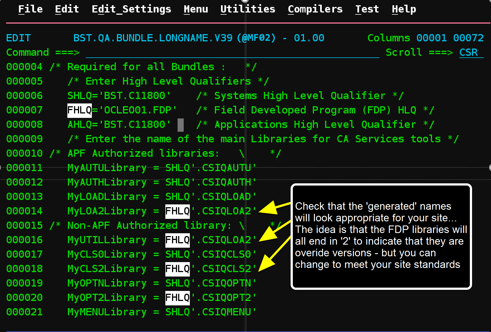
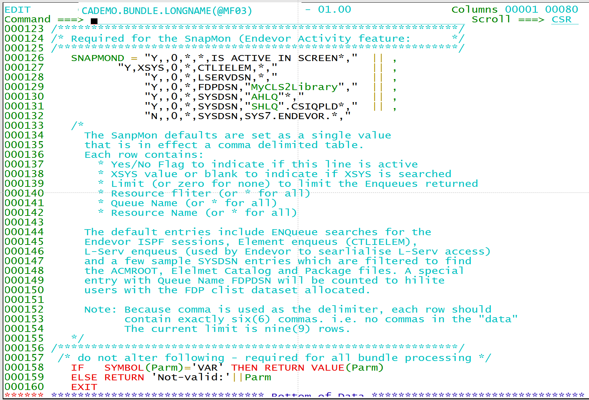
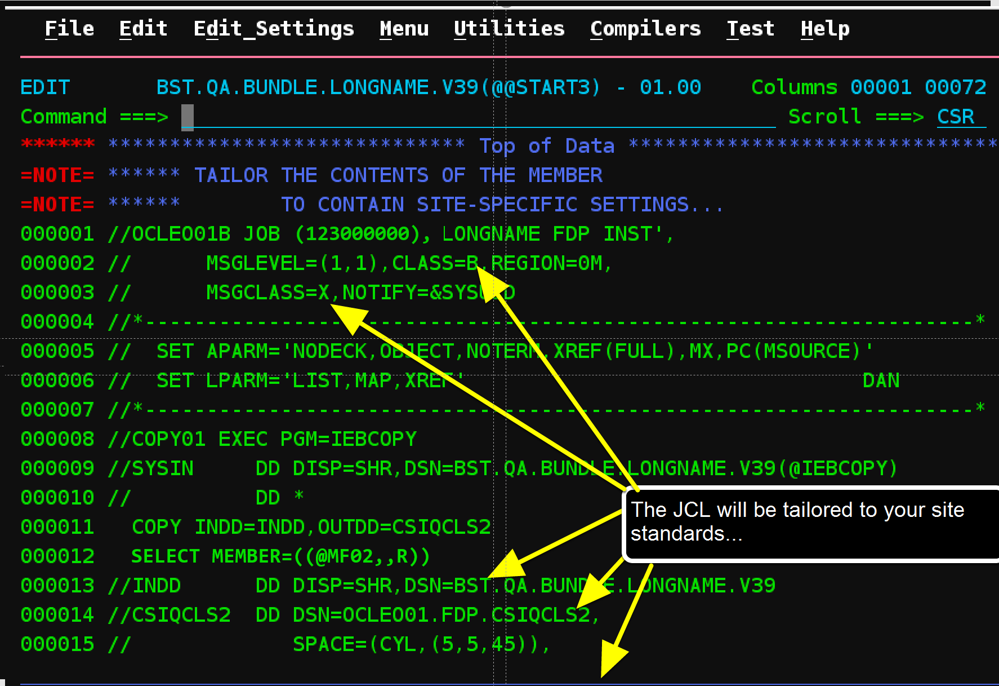
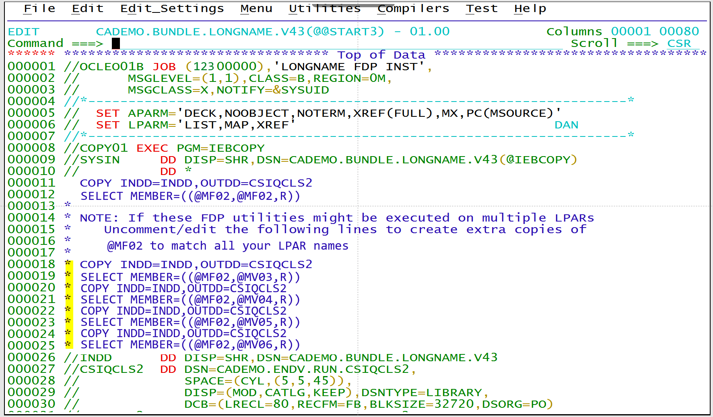
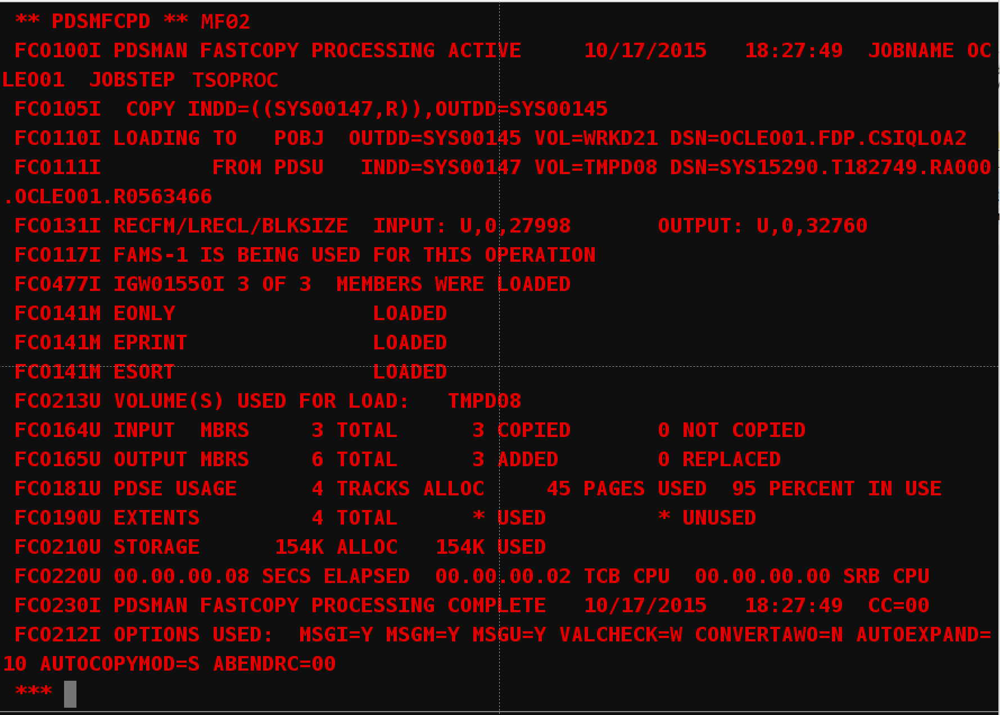

# LONGNAME

This is the V70 version of items formerly referenced as the **LongName Utility FDP**, and found on the [Endevor community website
](https://community.broadcom.com/mainframesoftware/viewdocument/longname-utility-fdp?CommunityKey=592eb6c9-73f7-460f-9aa9-e5194cdafcd2&tab=librarydocuments&LibraryFolderKey=&DefaultView=folder).

These older versions remain available only on the community website:

- LongNameFDP_V69.zip
- LongNameFDP_V67.zip
- LongNameFDP_V66.zip
- LongNameFDP_V49.zip

To install older versions see the **LongNameInstall.V43.pdf** file on the community site . 

## Installation steps from GitHub

Unpack (Upload) all files into a PDS or PDS/E dataset. Then edit the dataset.

### Execute @@START1
Type 'EX' on the @@START1 line to execute the initial tailoring step and press ENTER...
Execute @@START1 member to begin next steps. 

...checking for @SITE
The Exec will check for a previous installation configuration files (named with the at ('@') and the
LPAR or SYSID of the system... In this case one has been found and is copied into the current
dataset for editing

### Edit @SITE
This member is used to generate all the customized dataset names used at this site. In an ideal
world you will only have to change lines 6-8 to provide the high level qualifiers for your existing
Endevor install (SHLQ), application or User HLQ (AHLQ) and then select a name for the FDP high
level qualifiers.
The lines that follow use these values to establish individual dataset names for each of the Endevor
installation libraries and the (NEW) FDP libraries - you can of course override any dataset name as
needed.

Tailor to your site standards...
In this case Endevor is installed with a high level qualifier of 'BST.C11800' and I want the LongName
utility files to be stored under my "userid.FDP" for testing...

Set Job parameters...
If you scroll down a bit you can find override variables for the Job Account code, Job class and
Message class.
Then you can hit END to save your changes and proceed to the next step...
Note: The rest of the BUNDLE symbols are not required specifically for LongName and are reserved
for future use (mostly with other bundles, for example to automate Package processing, Scheduling
etc.) contact CA Services for more information...
Installing the LongName Utility FDP
LongNameInstall.

Note: to users upgrading from older releases
If you installed an older version of the FDP, you may be missing a "SNAPMON" section in your
@<sysid> member (see below for sample) - if this is the case I advise either deleting/renaming any
old @<sysid> members and re-executing @@START1, or retrofitting your changes into the
delivered @SITE member. To see what's changed, use the compare command e.g. the edit
command "compare (@SITE) x"
Remember after editing your @<sysid> member be sure to save a local copy so it will be re-used
next time.

### Execute @@START2
From the member list enter the EXecute command for the next member

...files are tailored...
This will tailor the remaining steps using the values you just provided in the @SITE member...

Edit @@START3 JCL
You will be brought into edit mode for the main install job with all the tailoring complete and the job
should be ready to run.

Edit as (if) necessary
The first step will allocate the target FDP libraries and copy the members into them, the remaining
steps will assemble and link the assembler helper routines used by LongName.
You can tailor this job as needed to your site standards, but ideally all edits should be completed
automatically using the values you specified in the @SITE member. If you spot anything wrong, you
can exit, and re-execute the @@START1 and @@START2 members to re-tailor your @SITE
member and try again - or just manually edit that job as needed. However, the advantage of getting
your @SITE member correct is that it can be re-used next time if there are new versions of this or
other FDP Bundles

### Submit @@START3
When you are happy, submit the job to run, and then exit Edit mode to free up the received dataset
(otherwise your job may sit waiting for datasets)

![

Note: For users with multiple LPARs
If you execute the FDP on multiple LPARS - you may need custom versions of the @<SYSID>
members, one for each LPAR. The @@START3 job is now enhanced to make extra copies of the
'current' @<sysid> member (@DE25) in this example below... simply uncomment the extra copy,
select member lines and update the "target @<sysid> member names" (CA11, CA31, CA31, XAD1
in the example below)

Check Job completed ok...
Allow your job to complete (by pressing ENTER as fast as you can (or just go and make a cup of
tea...)
No kidding, it doesn't take that long...

### Execute @@START4 (Optional)

This optional step will receive fixed versions of ESort, EOnly and EPrint that support the extra sort
columns provided by LongName and ESrchfor. They are automatically unpacked into your
MyLoa2Library which will already contain the other assembler helper modules.
Note: These versions contain overrides to the delivered Endevor programs, but rather than replace
the 'official' ones, you can execute these overrides using a LIBDEF to ISPLLIB (as demonstrated in
the following step...)

...unload completes

### Execute @@START5
The final step is to execute the Initial Program Verification (IVP)
Executing the @@START5 member will execute a sample startup Rexx that performs LIBDEF and
ALTLIB activates for the FDP libraries placing these libraries ahead of the standard Endevor ones...
You may either use this template ...CSIQCLS2(STARTFDP) or create new QuickEdit, Endevor and
LongName startup commands in line with your sites standards.
Hint: if you decide to create your own startup commands, I recommend you start with your existing
QuickEdit startup clist and create a new version adding the FDP libraries ahead of the standard
libraries (use the sample Rexx; STARTFDP as a guide) remembering to include a libdef for ISPLLIB
pointing to your MyLoa2Library (which you may not have needed before). This will allow you to start
QuickEdit with WideScreen, ECols, CompElm, and ESrchfor support. Then create a new LongStrt
startup clist based on this one that simply replaces the select 'PGM(ENDIE000) NOCHECK
PASSLIB' with select 'CMD(%LONGNAME) PASSLIB' to invoke the LongName Rexx instead.

Congratulations!
If you see the new FDP launch menu, the installation is sucessful, and you can now launch Endevor,
QuickEdit, the LongName utility with the FDP enhancements.
This menu also provides handy acces to the User Manu, PDM, ASCM and Batch Reports menus as
well, and a new option; SNAPMON to see what your Endevor users are up to.
Choose option 'L' to launch the LongName utility (or double click) the option in the list (point n'click)...
Installing the LongName Utility FDP
LongNameInstall.V43.

LongName Utility
You should now see the LongName utility panel - go ahead and explore the Help menu, option 'C' for
changes and a cheat sheat for all of the proto-type features that you would like to review - don't
forget to visit http://communities.ca.com to provide feedback on the features that you like most, and
to help CA determine which features you would like prioritized for consideration in the next
incremental or release, or to suggest your own enhancements.

Enable WideScreen support (optional)
To get the best out of the LongName and WideScreen enhancements it's recommened you use
screen sizes greater than 24x80 (Model2) or 43x80 (Model4) so you can see more columns and
more data. Ideally you can adjust your emulator settings to select the IBM DYNAMIC mode and
specify a screen size that works for you - I find 42x122 is a good compromise on smaller screens or
projetors, and 50x160 when using a reasonable external monitor. The exact method will depend on
your emulator, and possibly your session manager, but in general you need to find the option that
controls the emulation options - where you may see options like Model 2/3/4/5 and Dynamic, but
even if the highest width you can easily try is the model 5 (27x132) give that a try and see how it
works for you.
Even if you don't have access to a WideScreen emulation you can still use the ECols command to
adjust the column widths, colours etc. maybe you can save some space by using narrower columns,
or even hiding columns, that you don't need.

