# LONGNAME

This is the V70 version of items formerly referenced as the **LongName Utility FDP**, and found on the [Endevor community website
](https://community.broadcom.com/mainframesoftware/viewdocument/longname-utility-fdp?CommunityKey=592eb6c9-73f7-460f-9aa9-e5194cdafcd2&tab=librarydocuments&LibraryFolderKey=&DefaultView=folder).

High level features of this solution include:

- WideScreen - [Endevor QE Widescreen Support](https://community.broadcom.com//viewidea/?IdeationKey=73921ed5-8d52-4f32-b9eb-4571d9087ba1)
- ESrchfor - [As an End  user I need a better search tool](https://community.broadcom.com//viewidea/?IdeationKey=fa5a61e9-e975-4a45-bd92-896731cd0e5c)
- Diff Tool - [Enhanced element compare](https://communities.ca.com/ideas/235715290)
- User Extension Points - [User Extension Points in QuickEdit and Endevor](https://community.broadcom.com//viewidea/?IdeationKey=ddd501cf-852a-4ffd-bdc0-2f0ce8d0f81d) ...
- Project Switcher - [Endevor Project Switcher](https://community.broadcom.com//viewidea/?IdeationKey=5863efae-6330-4582-b2c0-63e1634145ed)

Older versions remain available only on the [Endevor community website
](https://community.broadcom.com/mainframesoftware/viewdocument/longname-utility-fdp?CommunityKey=592eb6c9-73f7-460f-9aa9-e5194cdafcd2&tab=librarydocuments&LibraryFolderKey=&DefaultView=folder):

- LongNameFDP_V69.zip
- LongNameFDP_V67.zip
- LongNameFDP_V66.zip
- LongNameFDP_V49.zip

To install older versions see the **LongNameInstall.V43.pdf** file on the community site.

## Encoding 

Here is what you can do in VSCode to ensure it uses the correct encodings:
In the workspace folder where you are putting the files (meaning ultimately in your Git repository) do this:

1) create folder called ".vscode" (if it doesn't already exist)
2) In the folder, create the file "settings.json"
3) Into the settings.json, put this content (including the brackets):

        {
        "files.encoding": "iso8859-1"
        }

## Installation steps from GitHub

Unpack (Upload) all files into a PDS or PDS/E dataset. Then edit the dataset.

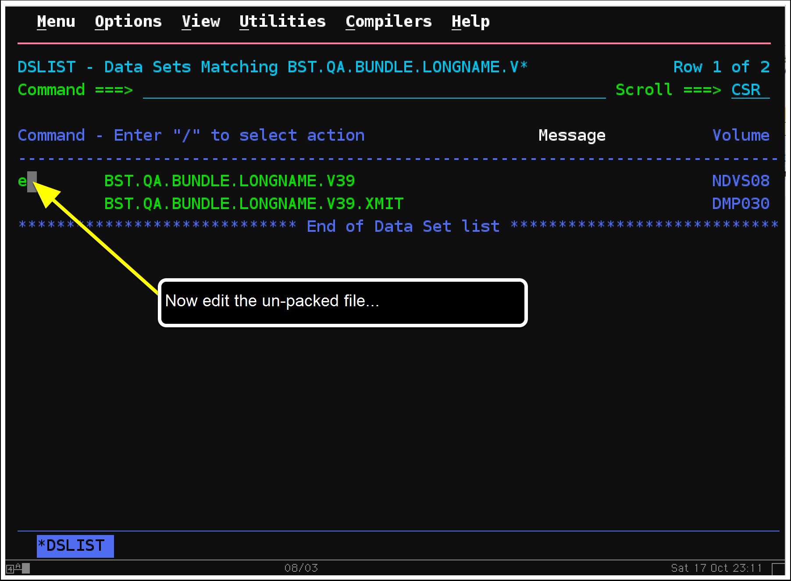

### Execute @@START1
Type 'EX' on the @@START1 line to execute the initial tailoring step and press ENTER...
Execute @@START1 member to begin next steps. 

### ...checking for @SITE

The Exec will check for a previous installation configuration files (named with the at ('@') and the LPAR or SYSID of the system... In this case one has been found and is copied into the current
dataset for editing

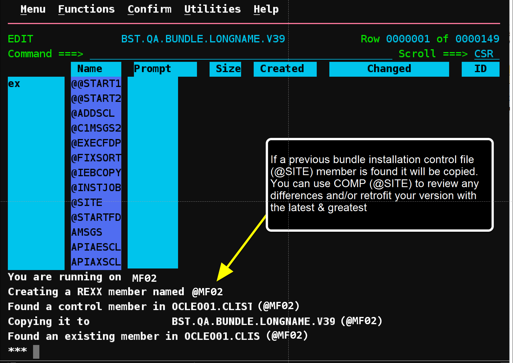

### Edit @SITE
This member is used to generate all the customized dataset names used at this site. In an ideal
world you will only have to change lines 6-8 to provide the high level qualifiers for your existing
Endevor install (SHLQ), application or User HLQ (AHLQ) and then select a name for the FDP high
level qualifiers.
The lines that follow use these values to establish individual dataset names for each of the Endevor installation libraries and the (NEW) FDP libraries - you can of course override any dataset name as
needed.

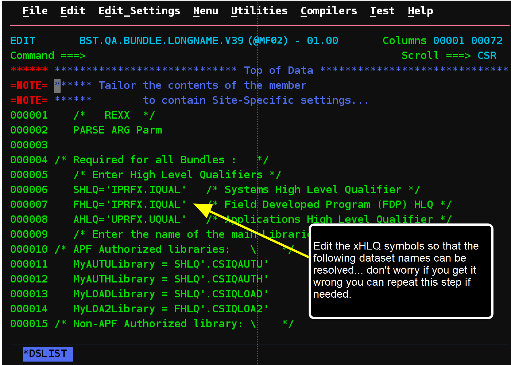

### Tailor to your site standards...
In this case Endevor is installed with a high level qualifier of 'BST.C11800' and I want the LongName
utility files to be stored under my "userid.FDP" for testing...

### Set Job parameters...
If you scroll down a bit you can find override variables for the Job Account code, Job class and Message class. Then you can hit END to save your changes and proceed to the next step...
Note: The rest of the BUNDLE symbols are not required specifically for LongName and are reserved
for future use (mostly with other bundles, for example to automate Package processing, Scheduling
etc.) contact CA Services for more information...
Installing the LongName Utility FDP
LongNameInstall.

### Note: to users upgrading from older releases
If you installed an older version of the FDP, you may be missing a "SNAPMON" section in your @<sysid> member (see below for sample) - if this is the case I advise either deleting/renaming any
old @<sysid> members and re-executing @@START1, or retrofitting your changes into the delivered @SITE member. To see what's changed, use the compare command e.g. the edit command "compare (@SITE) x"
Remember after editing your @<sysid> member be sure to save a local copy so it will be re-used next time.

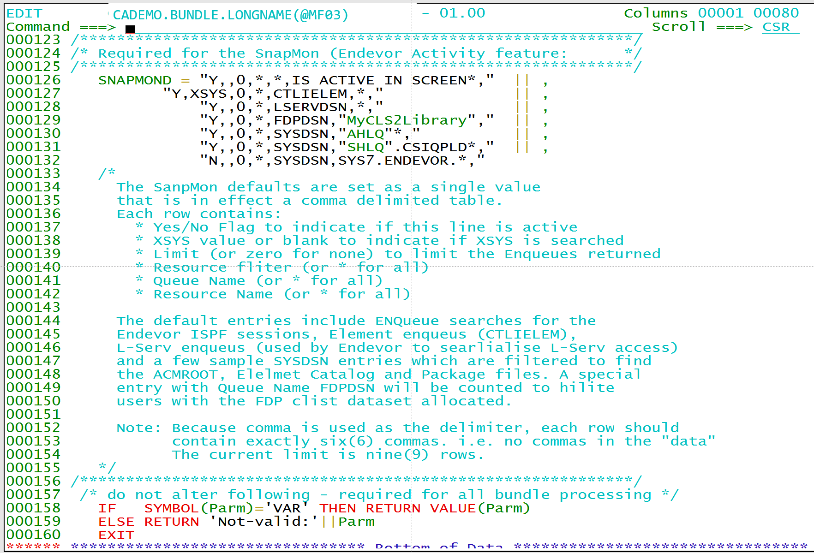

### Execute @@START2
From the member list enter the EXecute command for the next member

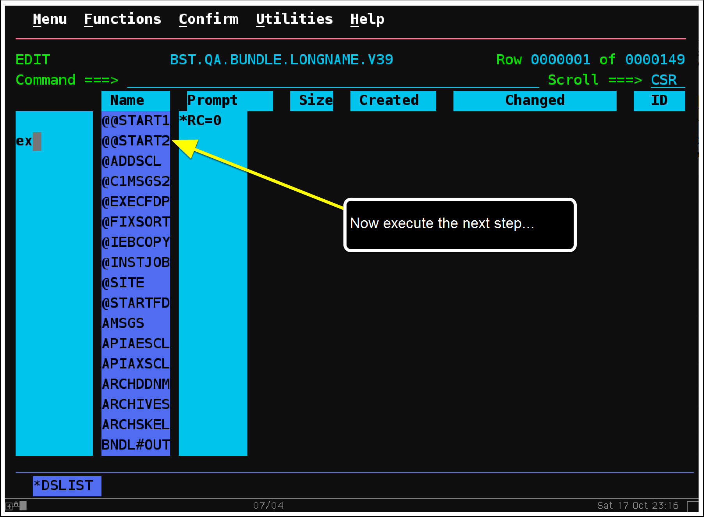

### ...files are tailored...
This will tailor the remaining steps using the values you just provided in the @SITE member...

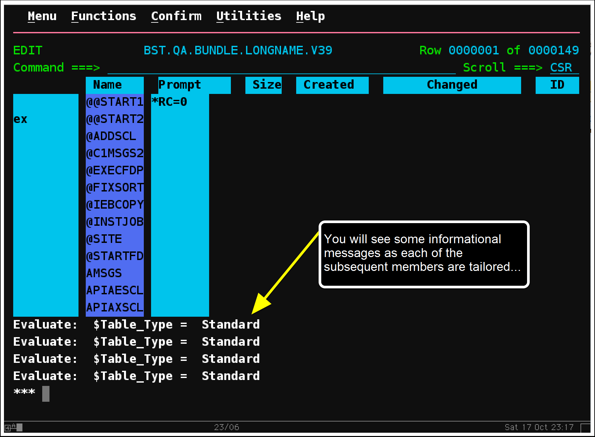

### Edit @@START3 JCL
You will be brought into edit mode for the main install job with all the tailoring complete and the job
should be ready to run.

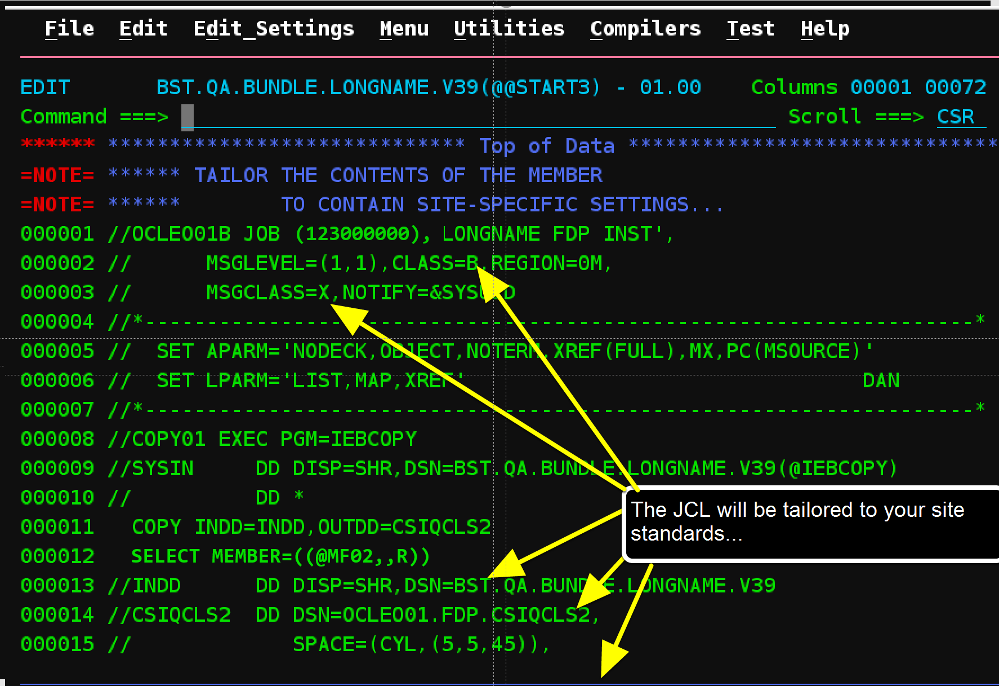

### Edit as (if) necessary
The first step will allocate the target FDP libraries and copy the members into them, the remaining steps will assemble and link the assembler helper routines used by LongName. You can tailor this job as needed to your site standards, but ideally all edits should be completed automatically using the values you specified in the @SITE member. If you spot anything wrong, you can exit, and re-execute the @@START1 and @@START2 members to re-tailor your @SITE
member and try again - or just manually edit that job as needed. However, the advantage of getting your @SITE member correct is that it can be re-used next time if there are new versions of this or
other FDP Bundles

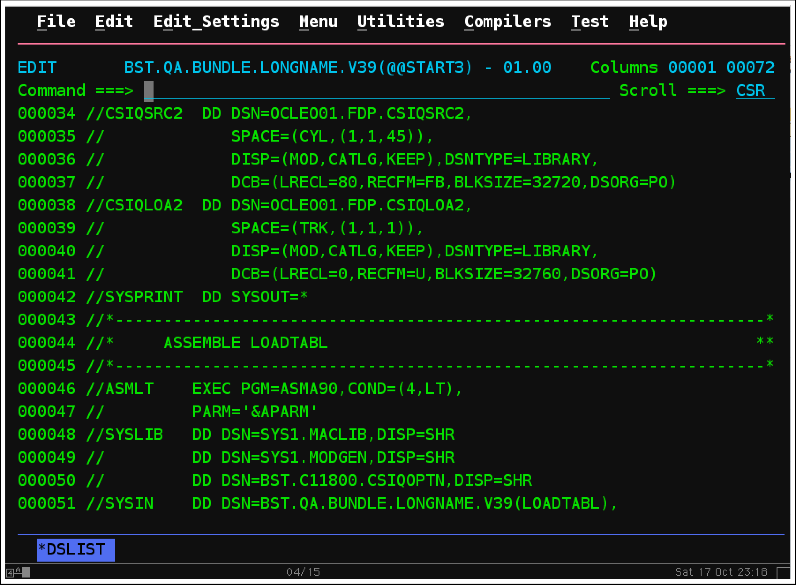

### Submit @@START3
When you are happy, submit the job to run, and then exit Edit mode to free up the received dataset
(otherwise your job may sit waiting for datasets)

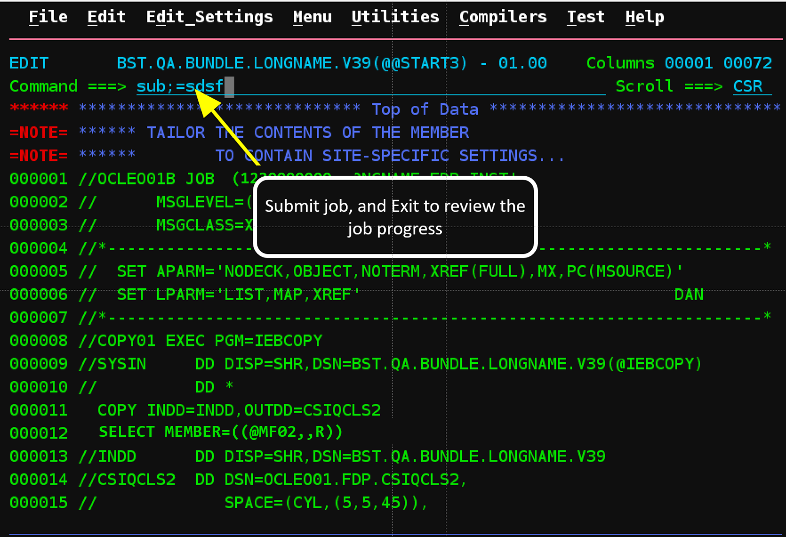![

### Note: For users with multiple LPARs
If you execute the FDP on multiple LPARS - you may need custom versions of the @<SYSID> members, one for each LPAR. The @@START3 job is now enhanced to make extra copies of the 'current' @<sysid> member (@DE25) in this example below... simply uncomment the extra copy, select member lines and update the "target @<sysid> member names" (MF03, MF04, MF05, MF06 in the example below)

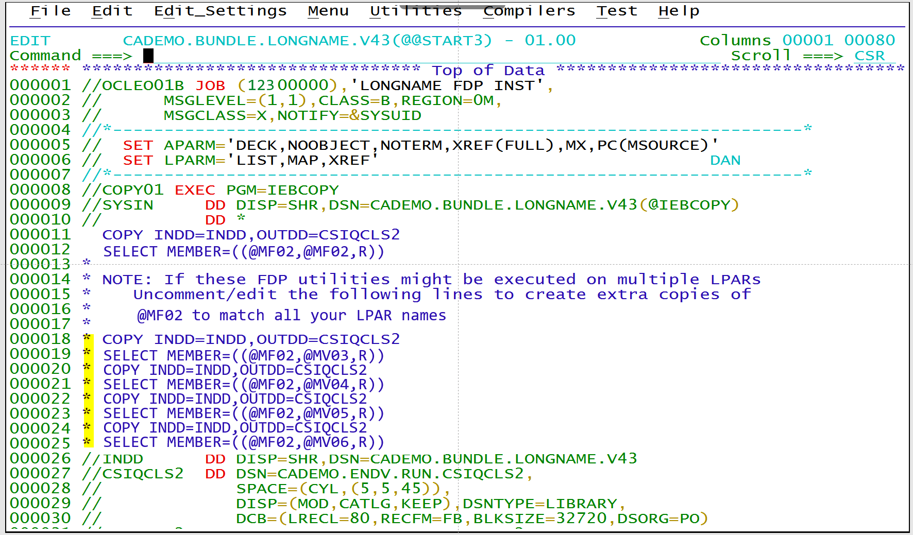

### Check Job completed ok...
Allow your job to complete (by pressing ENTER as fast as you can (or just go and make a cup of
tea...)
No kidding, it doesn't take that long...

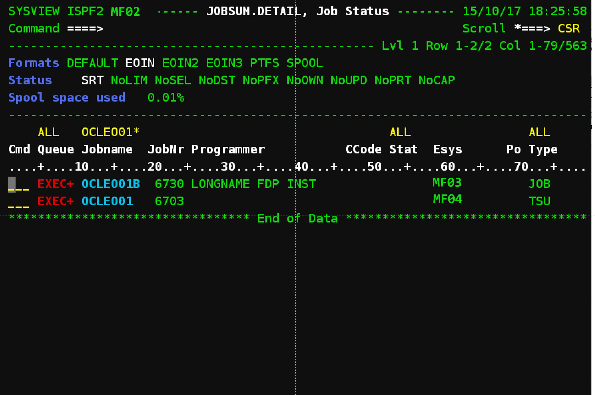

### Check Job Return Code
All steps should end with RC:0
The most common errors will be a typo in one of the dataset names or perhaps some extra parameters that you need to specify when allocating new libraries (mgmtclas, or storclas, or maybe
unit and vol=ser= info if you don't have SMS or CA Disk...

### Return to Edit...
Return to the unpacked installation job. 
You should find some extra @@STARTn members ready and waiting to complete the process...

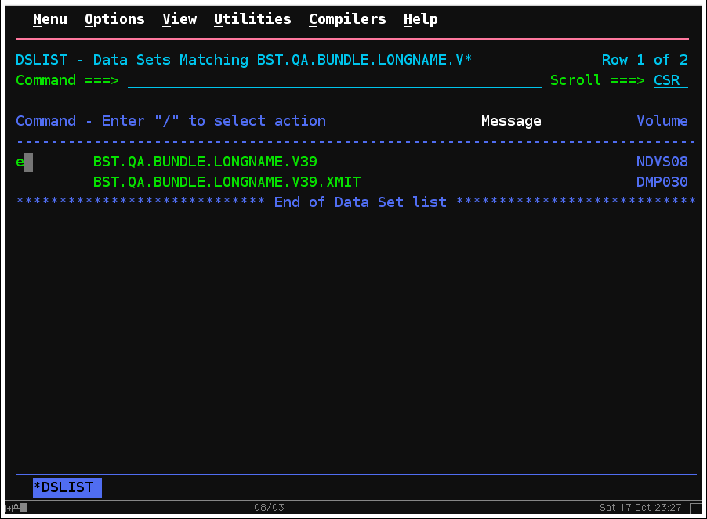

### Execute @@START4 (Optional)

This optional step will receive fixed versions of ESort, EOnly and EPrint that support the extra sort columns provided by LongName and ESrchfor. They are automatically unpacked into your MyLoa2Library which will already contain the other assembler helper modules.
Note: These versions contain overrides to the delivered Endevor programs, but rather than replace the 'official' ones, you can execute these overrides using a LIBDEF to ISPLLIB (as demonstrated in
the following step...)

### ...unload completes

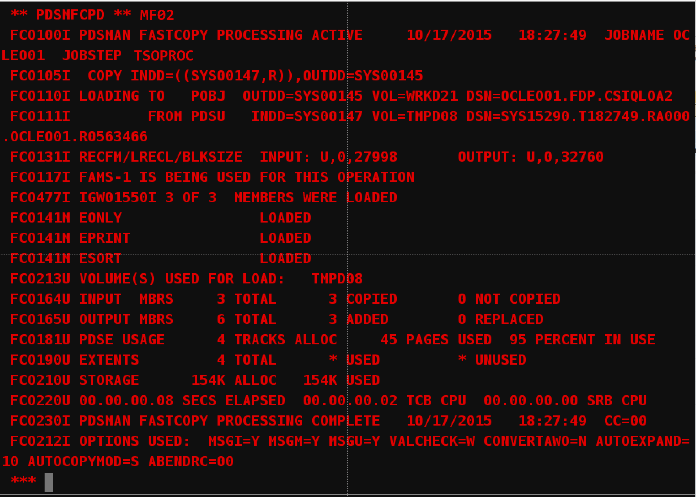

### Execute @@START5
The final step is to execute the Initial Program Verification (IVP)
Executing the @@START5 member will execute a sample startup Rexx that performs LIBDEF and ALTLIB activates for the FDP libraries placing these libraries ahead of the standard Endevor ones...
You may either use this template ...CSIQCLS2(STARTFDP) or create new QuickEdit, Endevor and LongName startup commands in line with your sites standards.

**Hint:** if you decide to create your own startup commands, I recommend you start with your existing QuickEdit startup clist and create a new version adding the FDP libraries ahead of the standard
libraries (use the sample Rexx; STARTFDP as a guide) remembering to include a libdef for ISPLLIB pointing to your MyLoa2Library (which you may not have needed before). This will allow you to start
QuickEdit with WideScreen, ECols, CompElm, and ESrchfor support. Then create a new LongStrt startup clist based on this one that simply replaces the select 'PGM(ENDIE000) NOCHECK PASSLIB' with select 'CMD(%LONGNAME) PASSLIB' to invoke the LongName Rexx instead.

### Congratulations!
If you see the new FDP launch menu, the installation is successful, and you can now launch Endevor, QuickEdit, the LongName utility with the FDP enhancements. This menu also provides handy access to the User Manu, PDM, ASCM and Batch Reports menus as well, and a new option; SNAPMON to see what your Endevor users are up to.

Choose option 'L' to launch the LongName utility (or double click) the option in the list (point n'click)...

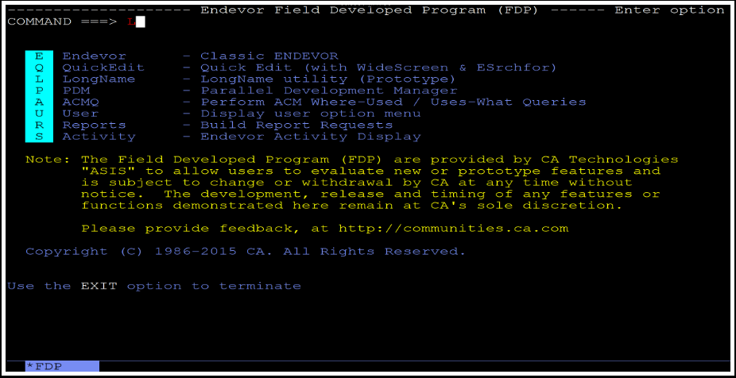

### LongName Utility
You should now see the LongName utility panel - go ahead and explore the Help menu, option 'C' for changes and a cheat sheet for all of the proto-type features that you would like to review - don't
forget to visit https://github.com/BroadcomMFD/broadcom-product-scripts/tree/main/endevor to provide feedback on the features that you like most, and to help CA determine which features you would like prioritized for consideration in the next
incremental or release, or to suggest your own enhancements.

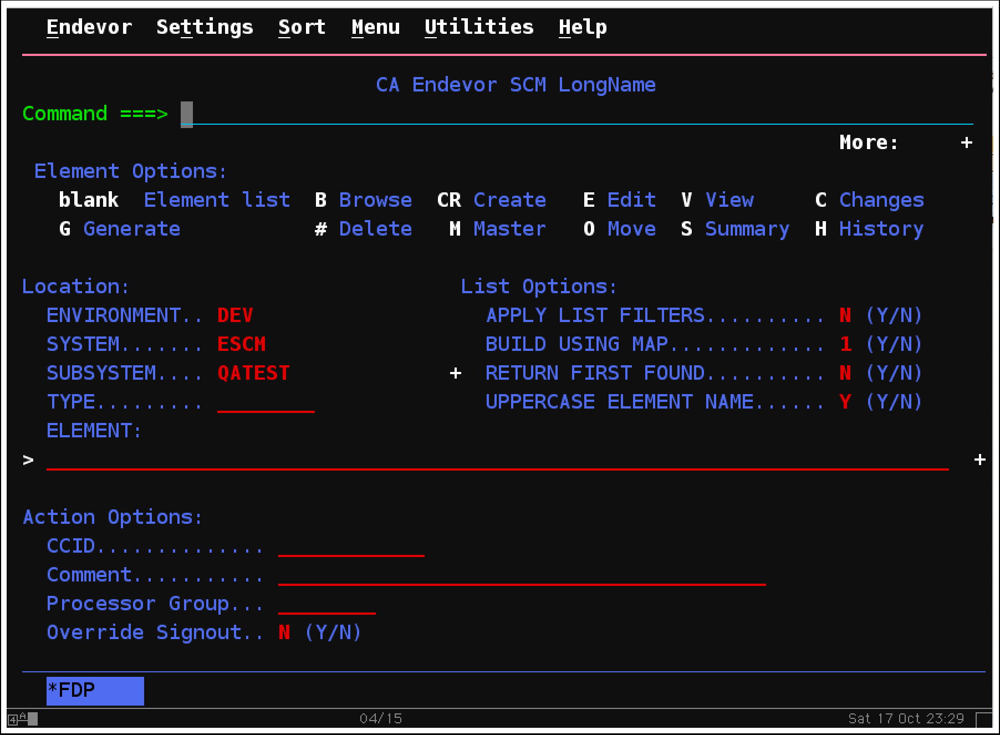

### Enable WideScreen support (optional)
To get the best out of the LongName and WideScreen enhancements it's recommended you use screen sizes greater than 24x80 (Model2) or 43x80 (Model4) so you can see more columns and more data. Ideally you can adjust your emulator settings to select the IBM DYNAMIC mode and specify a screen size that works for you - I find 42x122 is a good compromise on smaller screens or projectors, and 50x160 when using a reasonable external monitor. The exact method will depend on your emulator, and possibly your session manager, but in general you need to find the option that controls the emulation options - where you may see options like Model 2/3/4/5 and Dynamic, but even if the highest width you can easily try is the model 5 (27x132) give that a try and see how it works for you.

Even if you don't have access to a WideScreen emulation you can still use the ECols command to adjust the column widths, colors etc. maybe you can save some space by using narrower columns,
or even hiding columns, that you don't need.

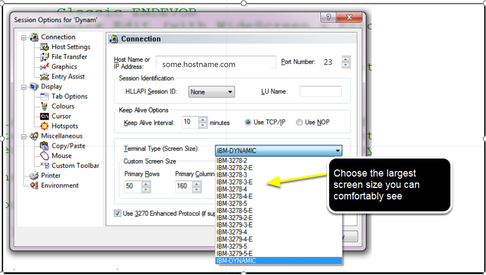

