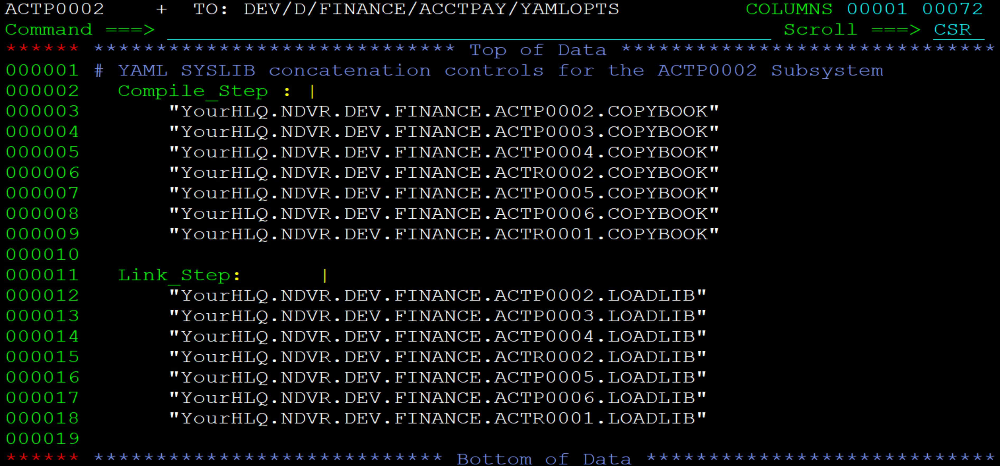
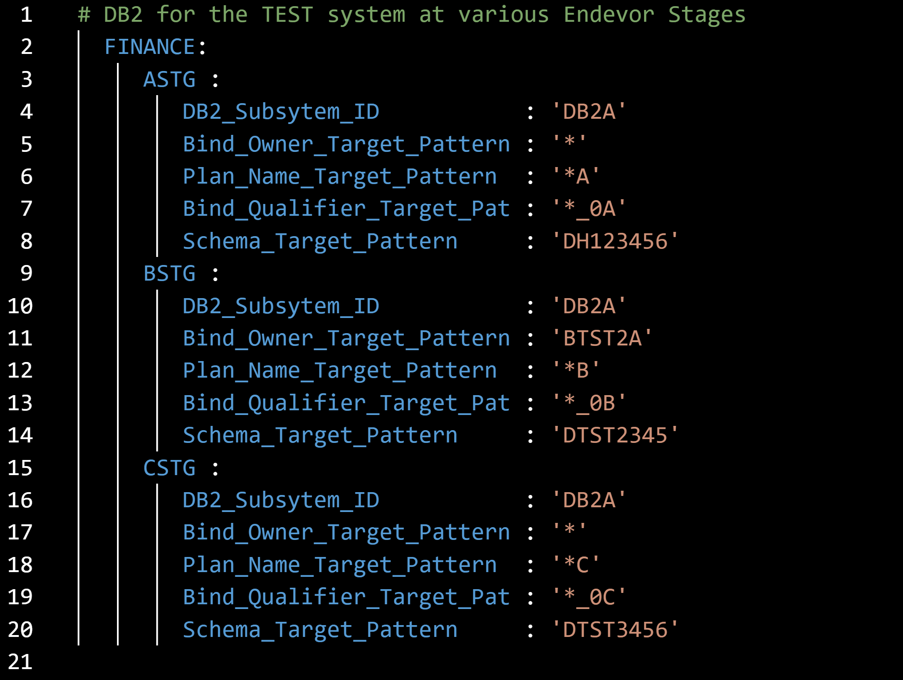

# Table Tool Processor Examples

Table Tool can run in your Endevor processors. This folder gives some things to consider, and some examples for the use of Table Tool in processors.

**Caution** When allowing OPTIONS as input

If developers have the ability to edit an OPTIONS element, you must take the following precautionary steps. Use a processor, such as [GOPTIONS](https://github.com/BroadcomMFD/broadcom-product-scripts/blob/main/endevor/Field-Developed-Programs/Processor-Tools-and-Processor-Snippets/GOPTIONS%20-%20Options%20syntax%20processor.jcl), to validate that the OPTIONS element only contains statements in one of these three acceptable formats:
- keyword = 'value'
- keyword = "value"
- keyword = number

In the Table Tool processor step that processes the options, you should reference them using IncludeQuotedOptions instead of including or appending them directly to the OPTIONS.

    x = 'IncludeQuotedOptions(UOPTIONS)';   
    . . .
    //UOPTIONS  DD  ... developer edited options*

## Table Tool as a complement to CONPARMX
You can find details of the [CONPARMX](https://techdocs.broadcom.com/us/en/ca-mainframe-software/devops/ca-endevor-software-change-manager/19-0/administrating/processors/processor-utilities/conparmx-utility.html) processor utility here, and a description of the **VALUECHK** program [here](https://github.com/BroadcomMFD/broadcom-product-scripts/tree/main/endevor/Field-Developed-Programs/Processor-Tools-and-Processor-Snippets). 

Here is an example step that tests user OPTIONS to determine whether MQSeries='Y' is specified:

    //MQSERIES EXEC PGM=IRXJCL,PARM='ENBPIU00 1 x'             GCOBOL       
    //TABLE    DD *                                                         
    *  MQSeries      $my_rc                                                 
       Y              1                                                     
       *              0                                                     
    //OPTIONS  DD *                                                         
      x = IncludeQuotedOptions(UOPTIONS)                                   
    //UOPTIONS DD *
      MQSeries = 'N'                                                        
    //SYSEXEC  DD DISP=SHR,DSN=your.CSIQCLS0                      
    //MODEL    DD DUMMY                                                     
    //TBLOUT   DD SYSOUT=*                                                  
    //SYSTSPRT DD SYSOUT=*                                                  

The VALUECHK program does the same kind of checking.

## Leveraging the Component list and CONMOVE in a MOVE processor

    //*********************************************************************
    //WRITE    EXEC PGM=CONWRITE,MAXRC=4                       DELBHIND    
    //CONWIN   DD *                                                        
    WRITE ELEMENT &C1ELEMENT                                             
        FROM ENV &C1SENVMNT SYSTEM &C1SYSTEM SUBSYSTEM &C1SSUBSYS         
            TYPE &C1ELTYPE STAGE &C1SSTGID                               
    TO DDN PRNTFILE                                                      
    OPTION COMPONENT.                                                    
    //PRNTFILE DD DSN=&&PRNTFILE,DISP=(NEW,PASS),                          
    //            UNIT=&TUNIT,SPACE=(TRK,(5,5)),                           
    //            DCB=(RECFM=FB,LRECL=203,BLKSIZE=4060)                
    //**********************************************************************
    //READCOMP EXEC PGM=IRXJCL,PARM='ENBPIU00 M O',MAXRC=4           
    //TABLE    DD DSN=&&PRNTFILE,DISP=(OLD,PASS)                            
    //POSITION DD *                                                         
        InOrOut  37 37                                                        
        DDNAME   49 56                                                        
        STEPNAME 29 36                                                        
        Member   39 46                                                        
        Dataset  57 100                                                       
    //OPTIONS  DD *                                                         
        $Table_Type = 'positions'                                             
        tempdsn = Translate(Dataset,' ','.');                                 
        lastnode = Word(tempdsn,Words(tempdsn))                               
        If lastnode = 'LISTLIB' then $SkipRow = 'Y'                           
    //MODEL    DD *               

Using the example, you can build BSTCOPY statement

## Working with YAML input

When combined with the [YAML2REX](https://github.com/BroadcomMFD/broadcom-product-scripts/blob/main/endevor/Field-Developed-Programs/Processor-Tools-and-Processor-Snippets/YAML2REX.rex) program, Table Tool can let you use YAML to drive automated actions. For information on YAML, find the official link [here](https://yaml.org/) and more [here](https://www.redhat.com/en/topics/automation/what-is-yaml).

YAML is easy to learn, and easy to use everywhere - from the ISPF panels in Quick-Edit to VSCode under CODE4Z. See examples of both in this section.

### YAML for Dynamic SYSLIBS

Items in the [Dynamic SYSLIB folder](https://github.com/BroadcomMFD/broadcom-product-scripts/tree/main/endevor/Field-Developed-Programs/Processor-Tools-and-Processor-Snippets/Dynamic-Syslib) demonstrate how each project in Endevor (Sandbox or dynamic Environment) may elect to include input components from other projects. Here is Quick-Edit view of a YAML element that controls library concatenations for the ACTP0002 Sandbox.

### YAML for Automating Processor DB2 Binds
Here is a VSCode view of an example YAML that provides DB2 Bind details to the Endevor processors for elements in the FINANCE system at various Endevor stages. 

This example shows "Pattern" entries, which are masking values to be applied to production Bind statements using the [DB2MASK#](https://github.com/BroadcomMFD/broadcom-product-scripts/blob/main/endevor/Field-Developed-Programs/Processor-Tools-and-Processor-Snippets/DB2MASK%23.rex) tool. 

Starting with these examples, you have a foundation for building your processors to leverage YAML to automate Endevor actions.

## Leveraging Endevor's ALLOC=LMAP/PMAP feature

In this example, the substitution of variables occurs during this processor step, with both Endevor and Table Tool performing the substitution, but only for variables they recognize. For instance, Endevor substitutes values for variables it is aware of (e.g., &C1 variables, processor variables, and Esymbols variables) while leaving others, including Table Tool variables, unchanged.

    //*********INCLUDE (TZUNITST)****************************************   
    //*--------------------------------------------------------------------*
    //T4ZUNI#1 EXEC PGM=IKJEFT1B,PARM='ENBPIU00 A'             TZUNITST     
    //*TABLE   is dynamically built from the LISTALC output for LMAPPED     
    //TABLE    DD  DSN=&&TABLE,DISP=(NEW,PASS),                             
    //             UNIT=SYSDA,SPACE=(TRK,(5,5)),                            
    //             DCB=(RECFM=FB,LRECL=080,BLKSIZE=24000)                   
    //*POSITION of data within the LISTALC output                           
    //POSITION DD  *                                                        
    Dataset  1 44                                                         
    //OPTIONS  DD *                                                         
    $Table_Type = "positions"                                             
    If $row# = 0 then, +                                                  
        Do; starthere = 0 ; stophere = 0 ; +                               
        X = OUTTRAP(line.); +                                            
        ADDRESS TSO 'LISTALC STATUS HISTORY'; +                          
    -  -  -  -  -  -  -  -  -  -  -  -  -  -  -  - 20 Line(s) not Displayed 
    //MODEL    DD DATA,DLM=QQ                                               
    //         DD DISP=SHR,DSN=&Dataset       
    QQ                                                           
    //SYSEXEC  DD DISP=SHR,DSN=&SYSEXEC1                         
    //         DD DISP=SHR,DSN=&SYSEXEC2                         
    //SYSIN    DD DUMMY                                          
    // IF ('&C1PRGRP(1,4)' = 'CICS') THEN                        
    //LMAPPED  DD DISP=SHR,DSN=&CICSLOAD,ALLOC=LMAP              
    //         DD DISP=SHR,DSN=&T4ZLOAD,ALLOC=LMAP               
    // ELSE                                                      
    //LMAPPED  DD DISP=SHR,DSN=&LOADLIB,ALLOC=LMAP               
    //         DD DISP=SHR,DSN=&T4ZLOAD,ALLOC=LMAP               
    // ENDIF                                                     
    //SYSTSPRT DD SYSOUT=*                                       
    //SYSTSIN  DD DUMMY                                          
    //TBLOUT   DD  DSN=&&LOADLIBS,DISP=(NEW,PASS),               
    //             UNIT=SYSDA,SPACE=(TRK,(1,1)),                 
    //             DCB=(RECFM=FB,LRECL=080,BLKSIZE=24000)                 

The process on this step unfolds as follows:
Endevor's actions before processor execution:
- Endevor replaces its known variables with corresponding values.
    - Endevor allocates files, including allocating TABLE as an initially empty dataset.
    - The ALLOC=LMAP clause for the LMAPPED DDname is expanded by - Endevor into multiple actual dataset names.
    - Endevor then initiates the execution of the processor and the T4ZUNI#1 step.
Table Tool execution:
- Table Tool begins execution while TABLE is still an empty file.
    - Before attempting to open the Table, Table Tool executes the commands specified in OPTIONS.
    - The LISTALC command within OPTIONS is executed, which lists all datasets currently allocated on the step.
    - Subsequent OPTIONS statements write this list of allocated datasets to the Table Tool Table.
    - Consequently, when Table Tool opens the Table, it contains the LISTALC data, including the datasets allocated by Endevor using the ALLOC=LMAP clause.
    - Table Tool reads the dataset names allocated for LMAPPED, applies the MODEL to format the output, and writes the expanded result to TBLOUT. In this case, the MODEL is a single line of JCL.
    - Upon completion of the step, the contents of TBLOUT will resemble the expanded JCL.

When the step completes, the content of TBLOUT might look something like this:

    //         DD DISP=SHR,DSN=Myhlq.ENDEVOR.DEV1.LOADLIB      
    //         DD DISP=SHR,DSN=Myhlq.ENDEVOR.DEV2.LOADLIB     
    //         DD DISP=SHR,DSN=Myhlq.ENDEVOR.QAS2.LOADLIB  
    //         DD DISP=SHR,DSN=Myhlq.ENDEVOR.PRD.LOADLIB  
    //         DD DISP=SHR,DSN=Myhlq.ENDEVOR.DEV1.T4ZLOAD      
    //         DD DISP=SHR,DSN=Myhlq.ENDEVOR.DEV2.T4ZLOAD     
    //         DD DISP=SHR,DSN=Myhlq.ENDEVOR.QAS2.T4ZLOAD  
    //         DD DISP=SHR,DSN=Myhlq.ENDEVOR.PRD.T4ZLOAD  

This method offers utility beyond automated test executions; for instance, it enables the inclusion of the expanded list of libraries within the processor output listings.

If you are unfamiliar with the use of processor includes, see an explanation [here](https://community.broadcom.com/HigherLogic/System/DownloadDocumentFile.ashx?DocumentFileKey=4e97b9d9-9a2e-6349-96e3-27c89ce5b00d).