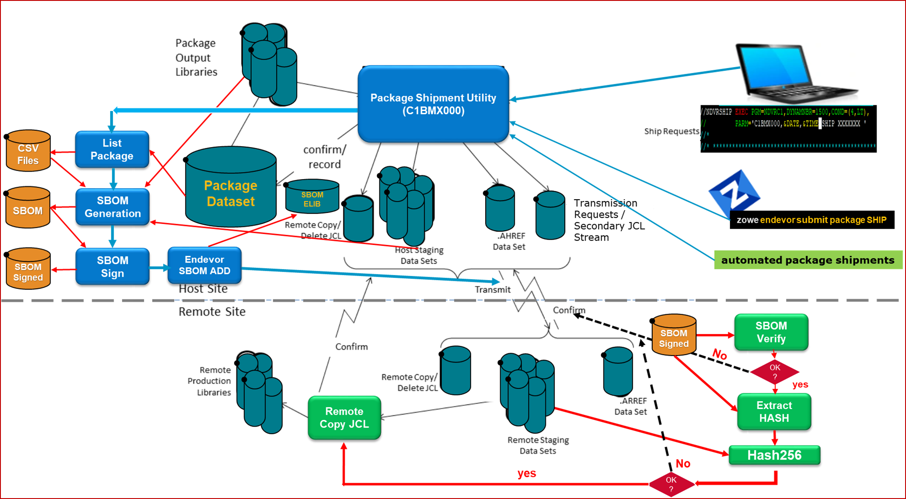

# Software Bill Of Materials 

## SBOM Shipping Approach 

- No manual steps are required. New steps are Automated and run under the Alt-ID
- SBOM signed at HOST System
- SBOM signature validation at Remote System. A signature verification failure will halt shipment delivery.  
- A hash-value comparison will halt shipment delivery if a discrepancy is found at the remote LPAR
- Implementation is easy and non-intrusive
- Source and examples will be placed on GitHub 

## Implementation Overview

- SBOM is generated and signed just before shipping the package to the Remote System.
- The SBOM is saved in an inventory location inside the ADMIN System or Environment.
- Package Actions and Element Components are generated explicitly using Endevor Actions. 
- Elements without components which are part of the package backout (Source O/P Library) are added to the SBOM as generic-file-source.
- The staging data sets that are part of the shipment are added to the SBOM as generic-file-source.
- During the execution of the Remote JOB,  SBOM signature verification is done using public key. If the verification fails, no HASHES validation and COPY to Production Libraries STEPs are executed.
- HASHES for every HOST staging dataset  are got from the SBOM and compared against the corresponding REMOTE Staging hashes. If any of them does not match, the REMOTE staging datasets are not copied to the production libraries and the JOB fails.
- Confirmation JOB informs about the Remote RC   

                                    SBOM Diagram
    )